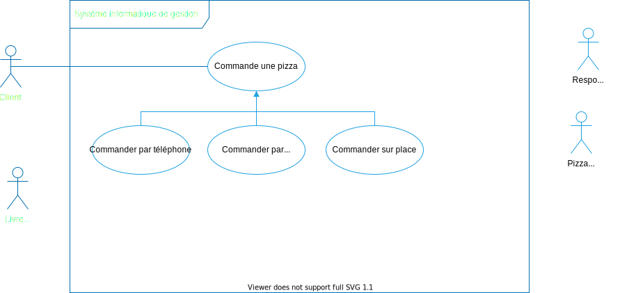

# Spécifications fonctionnelles d’un système de gestion de pizzerias

- **Date :** 1/05/2021
- **Client :** OC Pizza
- **Prestataire :** IT Consulting & Development

<!--
les différents acteurs interagissant avec le futur système ;
la liste des fonctionnalités ;
le descriptif des fonctionnalités ;
le cycle de vie des commandes.

2-3 personas -> impact mapping -> fonctionnalités par utilisateur
diagrammes de cas d'utilisation uml, ddd;
puis descriptif détaillés (scénarios uml ou user stories agiles) en détaillant bien le chemin utilisateur (chaque étape que l’utilisateur suivra pour la fonctionnalité en question);
bien modéliser le processus de prise de commande

Analyser un besoin client

Les acteurs sont clairement définis.
Les fonctionnalités explicites et implicites sont identifiées à partir du recueil des besoins.
Le processus de commande est modélisé.
Les points ci-dessus sont retranscrits dans le dossier de spécifications fonctionnelles.
----
Lister les fonctionnalités demandées par un client

Les fonctionnalités sont listées en suivant une méthodologie.
La liste est exhaustive.
----
Rédiger les spécifications détaillées d'un projet

Les fonctionnalités sont décrites en suivant une méthodologie.
Chaque fonctionnalité est décrite étape par étape, que ce soit textuellement et/ou via des schémas/diagrammes.
 -->

## Contexte

OC Pizza est un groupe de cinq points de vente de pizzas livrées ou à emporter qui ouvrira trois nouveaux points de vente dans six mois.

Son système informatique actuel :

1. ne lui permet pas une gestion centralisée de ses pizzerias pour suivre leurs ventes et leurs stocks d’ingrédients,
1. ne permet pas à ses livreurs de mettre à jour en temps réel le statut d’une livraison effectuée.

## Objectifs du client

OC Pizza a besoin d’un nouveau système informatique :

1. plus efficace pour traiter les commandes, de leur réception à leur livraison en passant par leur préparation,
1. permettant de suivre en temps réel les commandes :
   1. passées,
   1. en préparation,
   1. en livraison.
1. permettant de suivre en temps réel le stock d’ingrédients restant pour savoir quelles pizzas peuvent encore être préparées,
1. comportant un site internet pour que les clients puissent :
   1. passer leur commandes en plus de la prise de commande par téléphone ou sur place,
   1. payer en ligne leur commande ou payer directement à la livraison,
   1. modifier ou annuler leur commande tant que celle-ci n’a pas été préparée.
1. proposer un aide-mémoire aux pizzaiolos indiquant la recettes de chaque pizza.

## Aspects pratiques

Le nouveau système de gestion doit être mis en production pour l’ouverture des trois nouvelles pizzeria du groupe le 1/11/2021.

## Acteurs

Les acteurs identifiés sont :

1. le client.
1. le responsable du point de vente,
1. le livreur,
1. le pizzaiolo.

### Personas

#### Lia la cliente

- **Identité :**
  - Lia Clément,
  - 22 ans,
  - Étudiante en biochimie,
  - Célibataire,
  - Paris 20.
- **Biographie :** Passionnée par les jeux vidéos en ligne, elle commande fréquemment des pizzas chez OC Pizza parce qu’elle n’a que très peu de temps à consacrer à ses besoins vitaux (boire, manger, dormir).
- **Matériel informatique :** Un PC portable Alienware, un iPhone 12 Pro Max.
- **Aisance numérique :** \*\*\*\*\*
- **Citation :** _“Je n’ai pas de temps à perdre”_

#### Youssef le gérant

- **Identité :**
  - Youssef Benkacem,
  - 32 ans,
  - Gérant de l’OC Pizza de Paris 19,
  - Marié, un enfant,
  - Montreuil.
- **Biographie :** Alors qu’ils dévelopaient leur franchise, Franck et Lola ont fait appel à Karim il y a un an et demi quand ils n’ont plus eu le temps de s’occuper de leur pizzeria du nord-est de Paris. Il a su très rapidement reprendre la gestion de ce point de vente dans lequel travaillent deux pizzaïolos et trois livreurs.
- **Matériel informatique :** Un Galaxy S20 et un PC portable Dell.
- **Aisance numérique :** \*\*\*--
- **Citation :** _“J’ai toujours un œil sur les performances de mon point de vente”_

#### Thomas le livreur

- **Identité :**
  - Thomas Vogiel,
  - 24 ans,
  - Livreur de pizza,
  - En couple,
  - Paris 18.
- **Biographie :** Thomas a rejoint l’équipe de l’OC Pizza de l’avenue de Stalingrad il y a six mois. Il s’y sent bien et ne s’ennuie jamais : il y a toujours quelque chose à faire à OC Pizza !
- **Matériel informatique :** Un Galaxy S8 et une Xbox One 500 Go.
- **Aisance numérique :** \*\*---
- **Citation :** _“J’aime vivre à 49.9 à l’heure”_

#### Émelyne la pizzaïola

- **Identité :**
  - Émelyne Polia,
  - 35 ans,
  - Pizzaïola à OC Pizza,
  - Mariée, deux enfants,
  - Saint-Mandé.
- **Biographie :** Après des études d’arts plastiques et avoir occupé plusieurs postes dans la vente de prêt-à-porter dans le quartier du Sentier à Paris, elle est embauchée par Franck et Lola à l’ouverture du premier point de vente d’OC Pizza il y a trois ans dans le 19e arrondissement. Elle a trouvé rapidement sa place dans les cuisine de la pizzeria et elle est essentielle à son bon fonctionnement.
- **Matériel informatique :** Un smartphone Android vieux de plusieurs années qui ne lui sert qu’à téléphoner.
- **Aisance numérique :** \*----
- **Citation :** _“Toujours donner le meilleur de moi-même”_

## Interactions

### Cas d’utilisation

### Impact mapping

### User stories

### UML DDD
