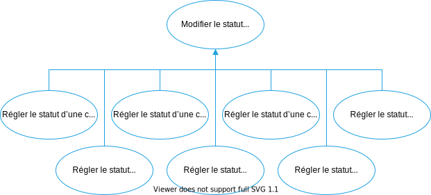
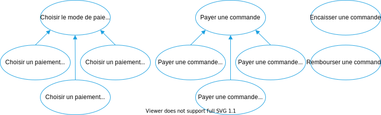
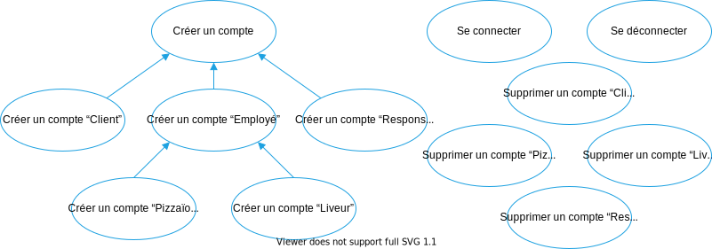
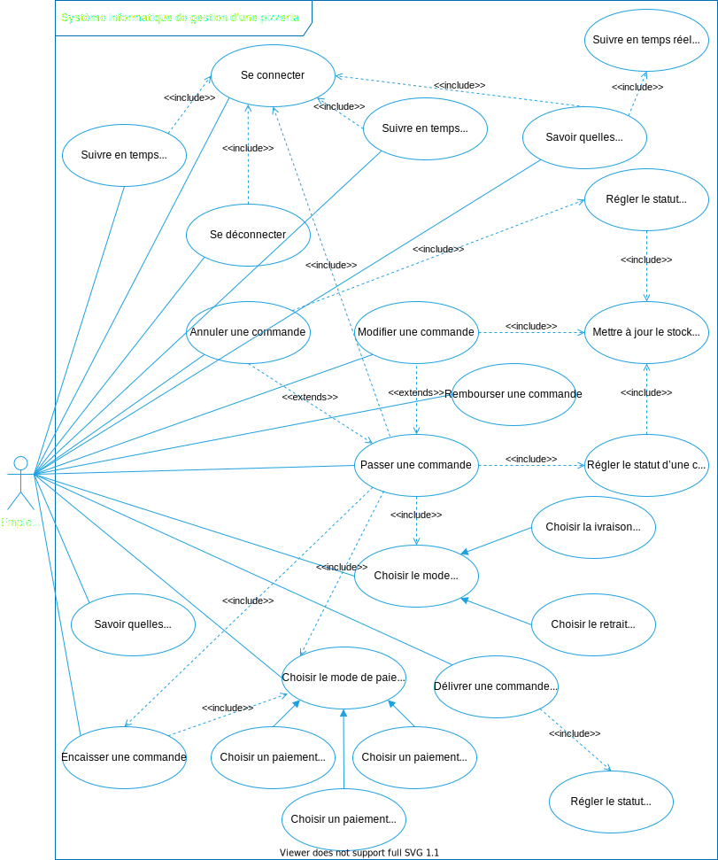
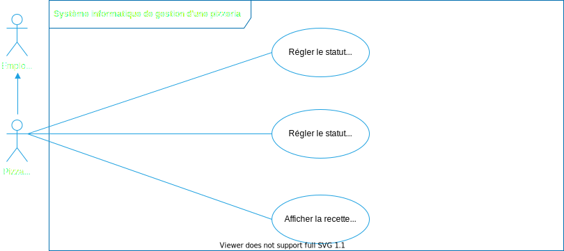
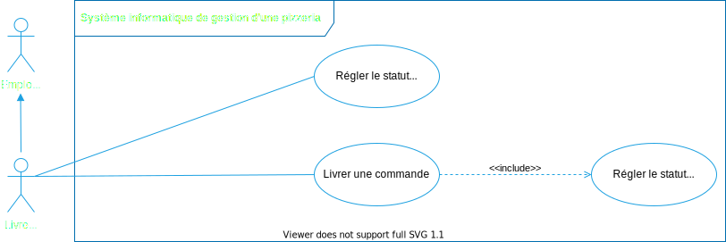
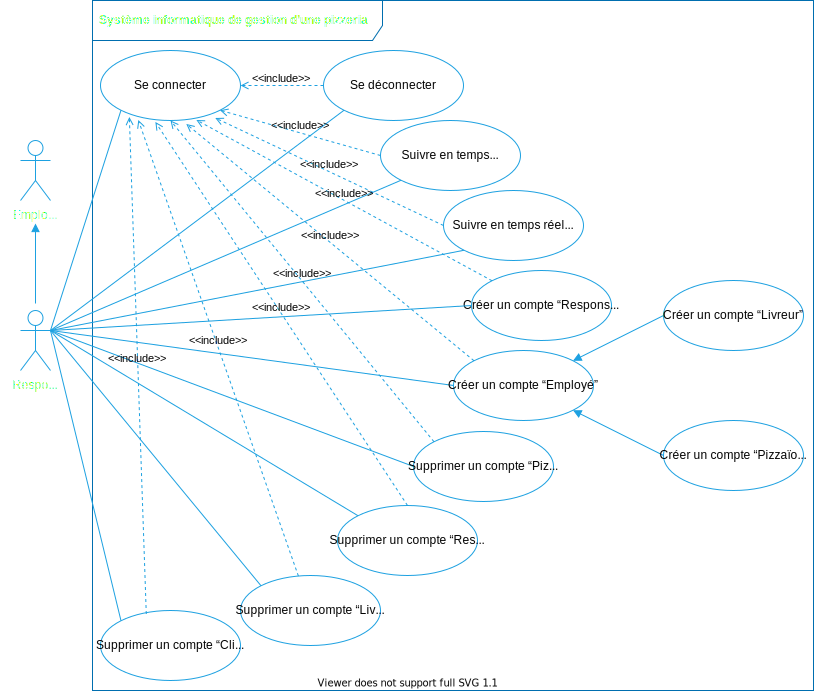

# Spécifications fonctionnelles d’un système de gestion de pizzérias

- **Date :** 1/05/2021
- **Client :** OC Pizza
- **Prestataire :** IT Consulting & Development

## Intentions et objectifs du présent document

Ces spécifications fonctionnelles, rédigées à partir du recueil des besoins du client, sont destinées :

1. à assurer au client que le prestataire a bien compris ses besoins pour les combler au mieux,
1. à présenter les solutions fonctionnelles qui guideront les choix de développement et de mise en production du projet.

Ainsi, à la suite de la présentation de ce document, il sera demandé au client :

1. de vérifier les informations et les données qui y sont décrites,
1. et d’approuver les solutions qui y sont présentées.

Dans le cadre des méthodes Agile, ce document devra être mis à jour en fonction de l’évolution du projet, de ses nouvelles données et des nouvelles solutions qui pourraient être mises en œuvre.

Chaque mise à jour de ce document par le prestataire devra être à nouveau vérifiée et approuvée par le client.

Les versions successives de ce document seront conservées et versionnées dans ce dépôt GitHub : [Dépôt GitHub des spécifications fonctionnelles du présent projet](https://github.com/centvingt/OCPizzaRedaction).

## Contexte

OC Pizza est un groupe de cinq points de vente de pizzas livrées ou à emporter qui ouvrira trois nouveaux points de vente dans six mois.

Son système informatique actuel :

1. ne lui permet pas une gestion centralisée de ses pizzérias pour suivre leurs ventes et leurs stocks d’ingrédients,
1. ne permet pas à ses livreurs de mettre à jour en temps réel le statut d’une livraison effectuée.

## Objectifs du client

OC Pizza a besoin d’un nouveau système informatique :

1. plus efficace pour traiter les commandes, de leur réception à leur livraison en passant par leur préparation,
1. permettant de suivre en temps réel les commandes :
   1. passées,
   1. en préparation,
   1. en livraison.
1. permettant de suivre en temps réel le stock d’ingrédients restant pour savoir quelles pizzas peuvent encore être préparées,
1. comportant un site internet pour que les clients puissent :
   1. passer leur commandes en plus de la prise de commande par téléphone ou sur place,
   1. payer en ligne leur commande ou payer directement à la livraison,
   1. modifier ou annuler leur commande tant que celle-ci n’a pas été préparée.
1. proposer un aide-mémoire aux pizzaiolos indiquant la recettes de chaque pizza.

## Aspects pratiques

Le nouveau système de gestion doit être mis en production pour l’ouverture des trois nouvelles pizzéria du groupe le 1/11/2021.

## Acteurs du système

Les acteurs interagissant avec le système identifiés explicitement dans le recueil des besoins sont :

1. le client qui consulte la carte et commande une pizza en ligne,
1. le responsable d’OC Pizza qui gère les pizzérias du groupe,
1. le pizzaïolo qui prépare une commande,
1. le livreur qui livre une commande à un client.

Par ailleurs, il est implicite que le livreur et le pizzaïolo peuvent être amenés à traiter les commandes passées sur place ou par téléphone.

Les acteurs du système sont donc :

1. le client,
1. le responsable,
1. l’employé,
1. le pizzaïolo qui généralise les cas d’utilisation de l’employé,
1. le livreur qui généralise les cas d’utilisation de l’employé.

## Interactions des acteurs avec le système

La lecture du recueil des besoins du client permet d’identifier :

1. des fonctionnalités explicitement demandées par le client, nommées ci-dessous les _fonctionnalités explicites_,
1. des fonctionnalités implicitement nécessaires au systèmes, ommées ci-dessous les _fonctionnalités implicites_,

### Fonctionnalités explicites

Ces fonctionnalités figurent clairemnt dans le recueil des besoins du client :

- Suivre en temps réel les commandes et leur statut
- Suivre en temps réel le stock d’ingrédients
- Savoir quelles pizzas peuvent encore être réalisées
- Passer une commande
- Payer une commande en ligne
- Payer une commande à la livraison
- Modifier une commande
- Annuler une commande
- Afficher la recette d’une pizza

### Fonctionnalités implicites

#### Fonctionnalités liées au statut d’une commande

Suivre le statut en temps réel des commandes reçues, en préparation et en livraison implique de modifier ce status. Par ailleurs, il est nécessaire à la bonne efficacité du système d’ajouter plusieurs statuts en plus des statuts _Reçue_, _En préparation_ et _En livraison_ :

- Modifier le status d’une commande :
  - Régler le statut d’une commande à “Reçue”
  - Régler le statut d’une commande à “En préparation”
  - Régler le statut d’une commande à “Prête”
  - Régler le statut d’une commande à “En livraison”
  - Régler le statut d’une commande à “Livrée”
  - Régler le statut d’une commande à “Retirée”
  - Régler le statut d’une commande à “Annulée”

#### Fonctionnalité liée au suivi stock d’ingrédients

Pour suivre en temps réel le stock d’ingrédients restant, il faut que le système permette de mettre à jour ce stock :

- Mettre à jour le stock d’ingrédients

Cette action devra être déclenchée :

1. à la réception de chaque commande,
1. à la modification ou l’annulation d’une commande si sa préparation n’a pas commencé.

#### Fonctionnalités liées au paiement

Il est tout d’abord nécessaire de choisir le mode de paiement :

- Choisir un mode de paiement :
  - Choisir un paiement en ligne
  - Choisir un paiement à la livraison
  - Choisir un paiement sur place

Pour payer une commande en ligne, à la livraison ou dans le point de vente, il est nécessaire que ces trois actions généralisent l’action de payer une commande :

- Payer une commande :
  - Payer une commande en ligne
  - Payer une commande à la livraison
  - Payer une commande sur place

Enfin, il nécessaire d’enregistrer le paiement de la commande :

- Encaisser une commande

Par ailleurs, OC Pizza exprime dans ses besoins l’annulation des commandes. Il est probable que cette annulation implique un remboursement :

- Rembourser une commande

#### Fonctionnalités liées à la livraison

Pour choisir la livraison de la commande ou son retrait sur place, ces actions sont nécessaires :

- Choisir le mode de livraison de la commande :
  - Choisir la livraison de la commande à domicile
  - Choisir le retrait de la commande sur place

L’action de délivrer une commande est aussi nécessaire :

- Délivrer une commande

#### Fonctionnalités liées à la connexion

Les acteurs devront se connecter au système pour commander une pizza, suivre les commandes, vérifier les stocks, etc. Cela nécessite donc les actions suivantes :

- Créer un compte :
  - Créer un compte “Client”
  - Créer un compte “Employé” :
    - Créer un compte “Pizzaïolo”
    - Créer un compte “Livreur”
  - Créer un compte “Responsable”
- Se connecter
- Se déconnecter
- Supprimer un compte “Client”
- Supprimer un compte “Pizzaïolo”
- Supprimer un compte “Livreur”
- Supprimer un compte “Responsable”

#### Fonctionnalités liées à la gestion du groupe

Les responsables du groupe OC Pizza doivent pouvoir :

- Suivre en temps réel les commandes du groupe et leur statut
- Suivre en temps réel le stock d’ingrédients du groupe

### Cas d’utilisation et récits utilisateur

#### Cas d’utilisation et récits utilisateur du visiteur et du client

Les cas d’utilisation du système par le visiteur et le client sont les suivants :

En analysant ce schéma, nous pouvons déterminer ces récits utilisateur :

> En tant que **client non connecter,** je veux **savoir quelles pizzas peuvent encore être réalisées** pour **passer une commande**
>
> En tant que **client non connecté,** je veux **me connecter** pour **passer une commande**
>
> En tant que **client non connecté,** je veux **créer un compte client** pour **me connecter**
>
> En tant que **client connecté,** je veux **passer une commande** pour **retirer cette commande au point de vente**
>
> En tant que **client connecté,** je veux **passer une commande** pour **me la faire livrer**
>
> En tant que **client non connecter,** je veux **me connecter** pour **modifier une commande**
>
> En tant que **client non connecté,** je veux **me connecter** pour **annuler une commande**
>
> En tant que **client connecté passant une commande avec une livraison à domicile,** je veux **choisir un paiement à la livraison** pour **passer une commande**
>
> En tant que **client connecté,** je veux **choisir un paiement en ligne** pour **passer une commande**
>
> En tant que **client connecté passant une commande avec un retrait sur place,** je veux **choisir un paiement sur place** pour **passer une commande**
>
> En tant que **client connecté,** je veux **choisir une livraison à domicile** pour **retirer ma commande**
>
> En tant que **client connecté,** je veux **choisir un retrait sur place** pour **retirer ma commande**
>
> En tant que **client non connecté,** je veux **me connecter** pour **supprimer mon compte client**
>
> En tant que **client connecté,** je veux **choisir un paiement en ligne** pour **payer ma commande**
>
> En tant que **client connecté passant une commande avec un retrait sur place,** je veux **choisir un paiemnet sur place** pour **payer ma commande**
>
> En tant que **client connecté passant une commande à la livraison,** je veux **choisir paiement à la livraison** pour **payer ma commande**

#### Cas d’utilisation et récits utilisateur de l’employé

L’employé de la pizzéria prend les commande du client passées sur place ou par téléphone :

Les récits utilisateur de l’employé sont :

> En tant qu’**employé,** je veux **savoir quelles pizzas peuvent encore être réalisées** pour **enregistrer une commande**
>
> En tant qu’**employé non connecté,** je veux **me connecter** pour **enregistrer une commande**
>
> En tant qu’**employé connecté,** je veux **traiter une commande** pour **répondre à la demande d’un client sur place**
>
> En tant qu’**employé connecté,** je veux **traiter une commande** pour **répondre à la demande d’un client par téléphone**
>
> En tant qu’**employé non connecter,** je veux **me connecter** pour **enregistrer une commande**
>
> En tant qu’**employé non connecté,** je veux **me connecter** pour **annuler une commande**
>
> En tant qu’**employé connecté traiter une commande avec une livraison à domicile,** je veux **choisir un paiement à la livraison** pour **enregistrer une commande**
>
> En tant qu’**employé connecté,** je veux **choisir un paiement en ligne** pour **enregistrer une commande**
>
> En tant qu’**employé connecté traitant une commande avec un retrait sur place,** je veux **choisir un paiement sur place** pour **enregistrer une commande**
>
> En tant qu’**employé connecté,** je veux **choisir une livraison à domicile** pour **enregistrer une commande**
>
> En tant qu’**employé connecté,** je veux **choisir un retrait sur place** pour **enregistrer une commande**
>
> En tant qu’**employé connecté,** je veux **choisir un paiement en ligne** pour **enregistrer une commande**
>
> En tant qu’**employé connecté traitant une commande avec un retrait sur place,** je veux **choisir un paiemnet sur place** pour **enregistrer commande**
>
> En tant qu’**employé connecté traitant une commande à la livraison,** je veux **choisir paiement à la livraison** pour **enregistrer ma commande**
>
> En tant qu’**employé connecté délivrant une commande au client,** je veux **encaisser la commande** pour **finaliser la commande**
>
> En tant qu’**employé connecté,** je veux **consulter la liste des commandes et de leur statut** pour **savoir quelles commandes sont prêtes**
>
> En tant qu’**employé connecté,** je veux **consulter la liste des commandes et de leur statut** pour **savoir quelles commandes sont à préparer**
>
> En tant qu’**employé connecté,** je veux **consulter l’état du stock des ingrédients** pour **réapprovisionner le stock**

#### Cas d’utilisation et récits utilisateur du pizzaïolo

Après avoir choisi une commande à préparer, le pizzaïolo règle le statut de cette commandes à “En préparation”, “Prête”. Il lui faut être connecté en tant que pizzaïolo pour utiliser ces fonctionnalités :

Les récits utilisateur du livreur sont :

> En tant que **pizzaïolo**, je veux **me connecter** pour **changer le statut d’une commande**
>
> En tant que **pizzaïolo authentifié en tant que tel**, je veux **suivre les commandes en temps réel** pour **planifier mes préparations**
>
> En tant que **pizzaïolo authentifié en tant que tel**, je veux **passer le statut d’une commande à “En préparation”** pour **la préparer**
>
> En tant que **pizzaïolo authentifié en tant que tel**, je veux **passer le statut d’une commande à “Prête à être livrée”** pour **qu’elle soit livrée au client**
>
> En tant que **pizzaïolo authentifié en tant que tel**, je veux **passer le statut d’une commande à “Prête à être retirée”** pour **qu’elle soit retirée par le client**
>
> En tant que **pizzaïolo authentifié en tant que tel**, je veux **afficher la recette d’une pizza** pour **la préparer rapidement et sans me tromper**

#### Cas d’utilisation et récits utilisateur du livreur

Après avoir choisi une commande prête à être livrée, le livreur règle le statut de cette commandes à “En livraison”, “Livrée” ou “Annulée”. Il lui faut être connecté en tant que livreur pour cela :

Les récits utilisateur du livreur sont :

> En tant que **livreur**, je veux **me connecte** pour **suivre les commandes en temps réel**
>
> En tant que **livreur authentifié en tant que tel**, je veux **suivre les commandes en temps réel** pour **planifier mes livraisons**
>
> En tant que **livreur authentifié en tant que tel**, je veux **passer le statut d’une commande à “En livraison”** pour **partir la livrer**
>
> En tant que **livreur authentifié en tant que tel**, je veux **passer le statut d’une commande à “Livrée”** pour **mettre terme à la commande**
>
> En tant que **livreur authentifié en tant que tel**, je veux **passer le statut d’une commande à “Annulée”** pour **mettre terme à la commande**

#### Cas d’utilisation et récits utilisateur du responsable du groupe OC Pizza

Le responsable de point de vente peut suivre en temps réel les commandes et l’évolution du stock d’ingrédients, il peut aussi créer et supprimer des comptes pour ses employés. Il peut supprimer le compte d’un client si nécessaire. De plus, il généralise les cas d’utilisation de ses employés. Bref, il peut tout faire à part créer un compte “Client” :

Les récits utilisateur spécifiques au responsable du groupe OC Pizza sont :

> En tant que **responsable non connecté**, je veux **me connecter** pour **gérer consulter le stock d’ingrédient d’un point de vente**
>
> En tant que **responsable non connecté**, je veux **me connecter** pour **créer un compte**
>
> En tant que **responsable non connecté**, je veux **me connecter** pour **supprimer un compte**
>
> En tant que **responsable connecté**, je veux **suivre les commandes en temps réel du groupe** pour **gérer le point de vente**
>
> En tant que **responsable connecté**, je veux **suivre le stock des ingrédient en temps réel** pour **anticiper mes commandes d’ingrédients**

## Processus de commande

La logique procédurale du processus de commande est tout d’abord décrite ici à partir d’un scénario nominal dans lequel le client :

1. crée un compte avant de se connecter ,
1. choisit de se faire livrer sa commande à domicile au lieu de la retirer dans le point de vente,
1. choisit de payer sa commande en ligne au lieu de la payer à la livraison ou dans le point de vente,
1. ne modifie pas sa commande ni ne l’annule.

### Scénario nominal du processus de commande

1. Le système affiche les pizza réalisables,
1. Le client ajoute une ou plusieurs pizzas réalisables à la commande,
1. Le client valide la commande
1. Le système propose au client de s’authentifier ou de créer un compte
1. Le client crée un compte
1. Le système invite le client à choisir un mode de livraison
1. Le client choisit de se faire livrer sa commande à son domicile
1. Le système invite le client à choisir un mode de paiement
1. Le client choisit de payer en ligne
1. Le client effectue son paiement en ligne
1. Le système crée une nouvelle commande avec le statut “Reçue”
1. Le système propose au client de modifier ou d’annuler sa commande s’il le souhaite
1. Le pizzaïolo passe la commande au statut “En préparation”
1. Le pizzaïolo passe la commande au statut “Prête”
1. Le livreur passe la commande au statut “En livraison”
1. Le livreur livre la pizza au domicile du client
1. La commande passe au statut “Livrée”

### Diagramme d’activité du processus de commande

Afin de traiter tous les cas de figure d’une commandes, ces scénarios alternatifs sont ajoutés au scénario nominal décrit plus haut :

1. le client se connecte sans avoir besoin de créer un compte,
1. le client choisit le retrait de sa commande sur place,
1. le client choisit le retrait de sa commande sur place et de payer sur place,
1. le client choisit de payer à la livraison,
1. le client choisit de modifier sa commande,
1. le client choisit d’annuler sa commande.

L’ensemble de ces activités, scénario nominal et scénarios alternatifs compris, est modélisé ainsi :

