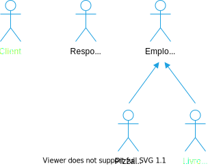

# Spécifications fonctionnelles d’un système de gestion de pizzerias

- **Date :** 1/05/2021
- **Client :** OC Pizza
- **Prestataire :** IT Consulting & Development

## Intentions et objectifs du présent document

Ces spécifications fonctionnelles, rédigées à partir du recueil des besoins du client, sont destinées :

1. à assurer au client que le prestataire a bien compris ses besoins pour les combler au mieux,
1. à présenter les solutions fonctionnelles qui guideront les choix de développement et de mise en production du projet.

Ainsi, à la suite de la présentation de ce document, il sera demandé au client :

1. de vérifier les informations et les données qui y sont décrites,
1. et d’approuver les solutions qui y sont présentées.

Dans le cadre des méthodes Agile, ce document devra être mis à jour en fonction de l’évolution du projet, de ses nouvelles données et des nouvelles solutions qui pourraient être mises en œuvre.

Chaque mise à jour de ce document par le prestataire devra être à nouveau vérifiée et approuvée par le client.

Les versions successives de ce document seront conservées et versionnées dans ce dépôt GitHub : [Dépôt GitHub des spécifications fonctionnelles du présent projet](https://github.com/centvingt/OCPizzaRedaction).

<!--
les différents acteurs interagissant avec le futur système ; -> OK
la liste des fonctionnalités ; -> en cours (diagramme des cas d’utilisation OK, )
le descriptif des fonctionnalités ; -> programmé
le cycle de vie des commandes. -> diagramme d'activité à faire

2-3 personas -> impact mapping -> fonctionnalités par utilisateur
diagrammes de cas d'utilisation uml, ddd;
puis descriptif détaillés (scénarios uml ou user stories agiles) en détaillant bien le chemin utilisateur (chaque étape que l’utilisateur suivra pour la fonctionnalité en question);
bien modéliser le processus de prise de commande

Analyser un besoin client

Les acteurs sont clairement définis.
Les fonctionnalités explicites et implicites sont identifiées à partir du recueil des besoins.
Le processus de commande est modélisé.
Les points ci-dessus sont retranscrits dans le dossier de spécifications fonctionnelles.
----
Lister les fonctionnalités demandées par un client

Les fonctionnalités sont listées en suivant une méthodologie.
La liste est exhaustive.
----
Rédiger les spécifications détaillées d'un projet

Les fonctionnalités sont décrites en suivant une méthodologie.
Chaque fonctionnalité est décrite étape par étape, que ce soit textuellement et/ou via des schémas/diagrammes.
 -->

## Contexte

OC Pizza est un groupe de cinq points de vente de pizzas livrées ou à emporter qui ouvrira trois nouveaux points de vente dans six mois.

Son système informatique actuel :

1. ne lui permet pas une gestion centralisée de ses pizzerias pour suivre leurs ventes et leurs stocks d’ingrédients,
1. ne permet pas à ses livreurs de mettre à jour en temps réel le statut d’une livraison effectuée.

## Objectifs du client

OC Pizza a besoin d’un nouveau système informatique :

1. plus efficace pour traiter les commandes, de leur réception à leur livraison en passant par leur préparation,
1. permettant de suivre en temps réel les commandes :
   1. passées,
   1. en préparation,
   1. en livraison.
1. permettant de suivre en temps réel le stock d’ingrédients restant pour savoir quelles pizzas peuvent encore être préparées,
1. comportant un site internet pour que les clients puissent :
   1. passer leur commandes en plus de la prise de commande par téléphone ou sur place,
   1. payer en ligne leur commande ou payer directement à la livraison,
   1. modifier ou annuler leur commande tant que celle-ci n’a pas été préparée.
1. proposer un aide-mémoire aux pizzaiolos indiquant la recettes de chaque pizza.

## Aspects pratiques

Le nouveau système de gestion doit être mis en production pour l’ouverture des trois nouvelles pizzeria du groupe le 1/11/2021.

## Acteurs du système

Les acteurs interagissant avec le système identifiés dans le recueil des besoins sont :

1. le client qui commande une pizza en ligne,
1. le responsable du point de vente qui traite une commande passée sur place ou par téléphone,
1. le livreur qui livre une commande à un client,
1. le pizzaïolo qui prépare une commande.

## Interactions des acteurs avec le système

Le recueil des besoins du client

<!-- à rédiger + figures
### Fonctionnalités explicitement identifiées

### Fonctionnalités implicitement identifiées

 -->

### Cas d’utilisation

### User stories

<!-- à rédiger -->

### Processus de commande

<!--  -->

### Diagramme de classes

<!--  -->
