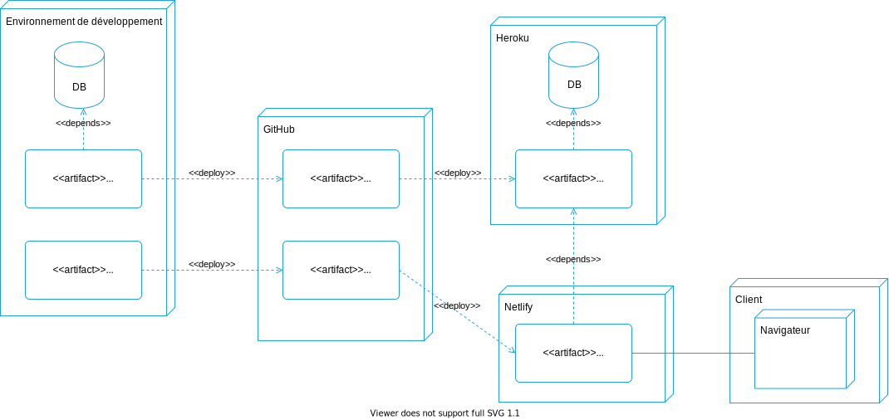
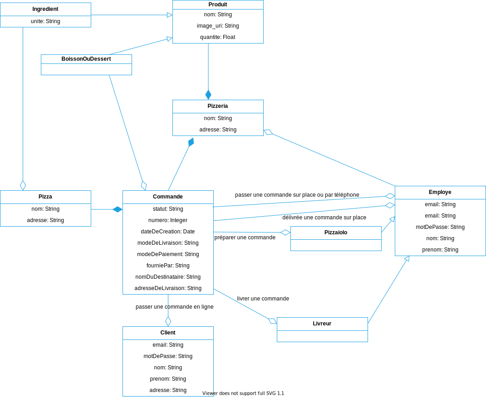
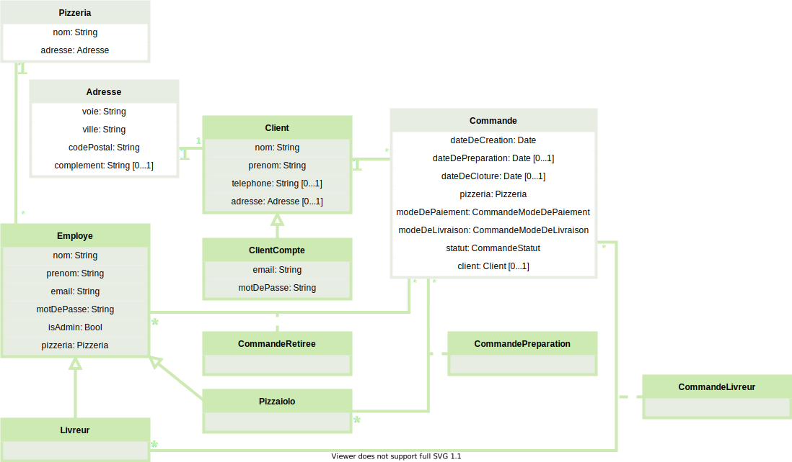
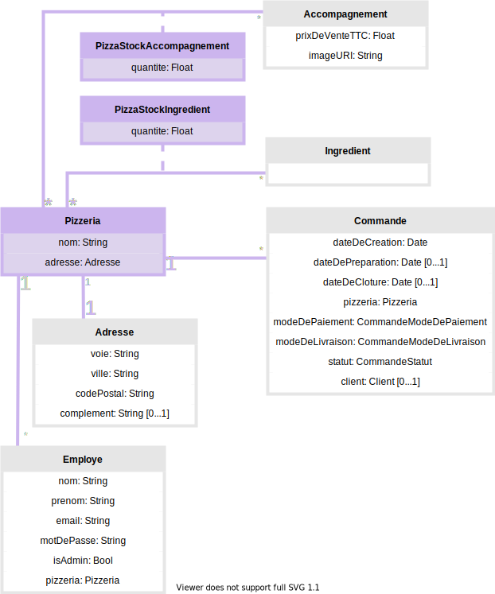
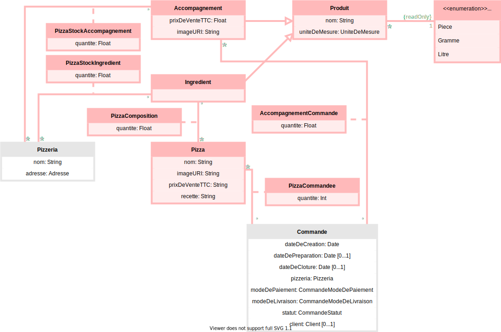
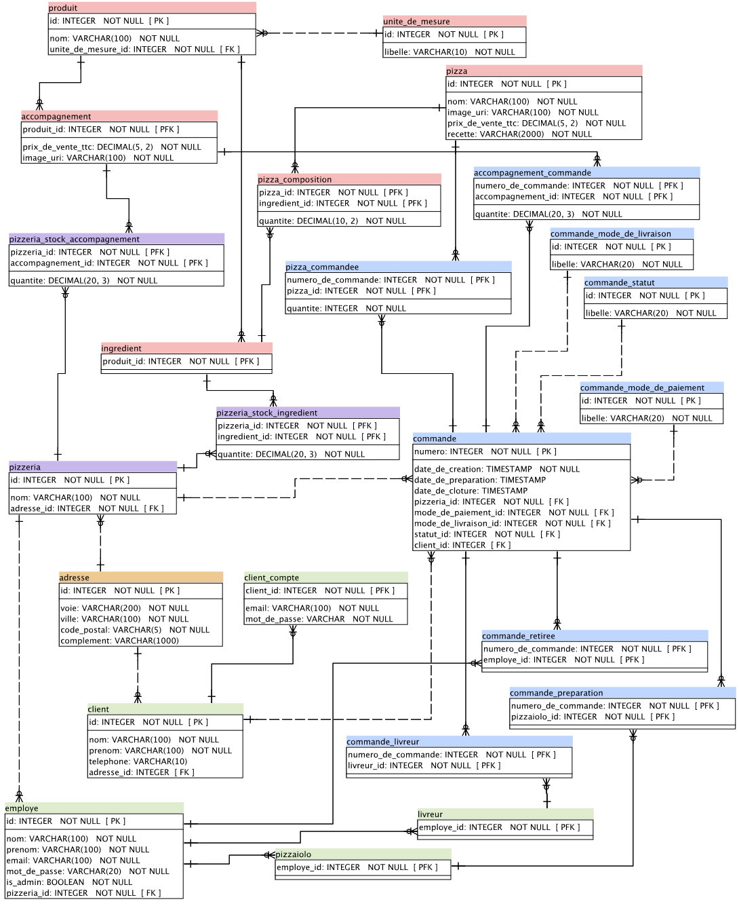

# Spécifications techniques d’un système de gestion de pizzérias

- **Date :** 15/05/2021
- **Client :** OC Pizza
- **Prestataire :** IT Consulting & Development

## Intentions et objectifs du présent document

Les spécifications techniques présentées ici découlent :

1. du recueil des besoins du client,
1. et des spécifications fonctionnelles rédigées à cette occasion.

Ces spécifications techniques visent à :

1. présenter les technologies qui seront utilisée pour développer le projet,
1. décrire la structure du code qui sera développé,
1. expliquer comment l’application sera déployée et mise en production,
1. modéliser le Système de gestion de la base de données (SGBD).

Les spécifications fonctionnelles et techniques sont sauvegardées et versionnées sur GitHub : [Dépôt GitHub des spécifications fonctionnelles et techniques du présent projet](https://github.com/centvingt/OCPizzaRedaction).

## Technologies utilisées

### Backend

Le backend se limite à une simple API GraphQL développée en Node.js avec le _framework_ Express.

Elle traite peu de logique métier pour limiter les temps de réponse du serveur tout en réduisant les ressources nécessaires au serveur pour exécuter cette API.

Le SGBD utilisé est PostgreSQL, un outil libre et gratuit sous licence BSD.

Certains composants de l’API sont couplés à des _web sockets_ pour transmettre au client des données en temps réel lors de leur mise à jour dans la base de données.

## Frontend

Les applications clientes (site internet et applications mobiles et tablettes pour le client, le livreur et le pizzaïolo) traitent elles-mêmes la majeure partie de la logique métier.

Elles s’appuient sur des requêtes GraphQL de l’API dont elles consomment les données pour construires les interfaces utilisateurs qu’elles affichent. Ainsi, la plupart du travail de l’application se fait du côté du client, l’API se contentant de lui fournir les données dont il a besoin.

Les applications clientes seront développées en React avec le _framework_ Gatsby pour le site internet et en React Native pour les applications mobiles et tablettes.

## Composants

Les diverses interfaces utilisateurs web et mobiles d’OC Pizza consomment l’API avec des requêtes HTTP pour présenter les données de cette API et lui transmettre les interactions des utilisateurs.

Lors de la connexion d’un utilisateur, l’API fournit au client un JSON _web token_ qui lui permet par la suite d’accéder aux ressources protégées de l’API.

Les requêtes HTTP sont traitées ainsi par l’API :

1. le routeur les intercepte,
1. il transmet chaque requête au Contrôleur concerné,
1. et celui-ci utilise le Modèle pour requêter la base de données.

Ensuite, l’API envoie sa réponse au client.

Les requêtes et les réponses sont toutes structurées en GraphQL.

## Déploiement et mise en production

Les applications web et mobiles sont déployées en continu pour fournir aux utilisateurs finaux des services augmentés de nouvelles fonctionnalités au fur et à mesure de leur développement.

Le déploiement continu de l’applications web consistera à _pusher_ la branche de production du dépôt Git présent sur l’ordinateur du développeur vers un dépôt sur GitHub auquel les services d’Heroku (pour l’API) et de Netlify (pour le site statique) sont connectés.

L’utilisateur final (le client, l’employé, le livreur ou le pizzaïolo) accède ainsi au site statique hébergé par Netlify et mis à jour via GitHub. Ce site consomme l’API Express GraphQL hébergé par Heroku et lui aussi mis à jour via GitHub.

Les trois applications mobiles (pour le client, le livreur et le pizzaïolo) sont chacune développées en React Native à la fois pour iOS et Android. Elles sont déployées sur l’AppStore et le GooglePlay, les stores respectifs des appareils iOS et Android.

## Domaine fonctionnel

### Diagramme des classes

Les classes sont réparties en quatre groupes :

1. les classes responsables des **comptes d’utilisateurs** (en vert sur ce diagramme),
1. les classes responsables des **pizzerias**, de **leurs stocks**, de **leurs commandes** et de **leurs employés** (en violet sur ce diagramme),
1. les classes responsables des **pizzas** et des **produits alimentaires** (en rose sur ce diagramme),
1. les classes responsables des **commandes** (en bleu sur ce diagramme).

### Les comptes d’utilisateurs

Les employés dépendent d’une pizzéria du groupe OC Pizza. Ce sont eux qui délivrent les commandes retirées sur place par les clients et figurent à ce titre dans une instance de la classe d’association **CommandeRetiree**.

Les employés sont :

1. soit des livreurs qui sont ajoutés à une instance de la classe d’association **CommandeLivreur** à chaque livraison d’une commande,
1. soit des pizzaïolos qui sont ajoutés à une instance de la classe d’association **CommandePreparation** quand ils réalisent une commande.

Les clients n’ont pas forcément besoin de créer un compte s’ils passent leur commande sur place ou par téléphone. En créant un compte :

1. les clients figureront dans une instance de la classe **ClientCompte**,
1. et ils auront accès à l’historique de leurs commande et la possibilité éventuelle de les modifier ou de les annuler.

Un client qui passe sa commande sur place ou par téléphone pour se faire livrer n’a pas forcément besoin de créer un compte lui permettant d’accéder à son historique de commande en se connectant avec un e-mail et un mot de passe. Mais dans ce cas, l’employé enregistrera tout de même ce client dans une instance de la classe **Client**, notamment pour que son adresse soit enregistrée.

De même, un client qui passe sa commande sur place et qui la retire sur place ne sera pas enregistré. Dans ce cas :

1. la commande (une instance de la classe **Commande**) n’aura pas de propriété **client**,
1. et aucune instance de la classe **Client** ne sera créée.

### Les pizzerias, leurs stocks, leurs commandes et leurs employés

Des instances des classes d’association **PizzaIngredient** et **PizzaAccompagnement** permettent de suivre le stock des ingrédients et des accompagnements (boisson, desserts, etc.) d’une pizzéria.

### Les pizzas et les produits alimentaires

Les classes **Accompagnement** (les boissons, desserts, etc.) et **Ingredient** (les ingrédients des pizzas) héritent de la classe **Produit**.

Un de ces produits est une instance de la classe **Produit** qui a une unité de mesure (à la pièce, au gramme ou au litre) pour le quantifier. Cela permet :

- de quantifier les ingrédients entrant dans la composition d’une pizza,
- d’établir l’état des stocks d’ingrédients et d’accompagnements.

## Les commandes

Une commande a obligatoirement une date de création. Puis au cours du processus de commande, lui sont ajoutées des dates de préparation et de clôture (quand la pizza est livrée, retirée ou annulée).

Une instance de la classe **Commande** n’est pas forcément liée à une instance de la classe **Client**. En effet, quand un client passe sa commande sur place pour la retirer sur place il peut ne pas ne pas avoir de compte et la pizzéria n’a pas besoin de son nom, de son prénom, de son adresse, etc. Mais dans ce cas, ce client ne bénéficiera d‘un historique de ses commandes.

C’est l’employé de la pizzeria qui délivre sa commande au client qui la retire sur place et à ce titre la classe d’association **CommandeRetiree** contient des instances de la classe **Employe**. De même :

- la classe d’association **CommandePreparation** contient des instances de la classe **Pizzaiolo** pour lister les commandes et leur préparateurs,
- et la classe d’association **CommandeLivreur** contient des instances de la classe **Livreur** pour lister les commandes et leurs livreurs.

Le contenu d’une commande est listé dans les classes d‘association **PizzaCommandee** (les pizzas commandées) et **AccompagnementCommande** (les accompagnements commandés, c’est-à-dire les boissons et les desserts de la commande).

## Modèle physique de données

Le modèle physique de données reflète les classes de l’application et permet de construire la base de données :

