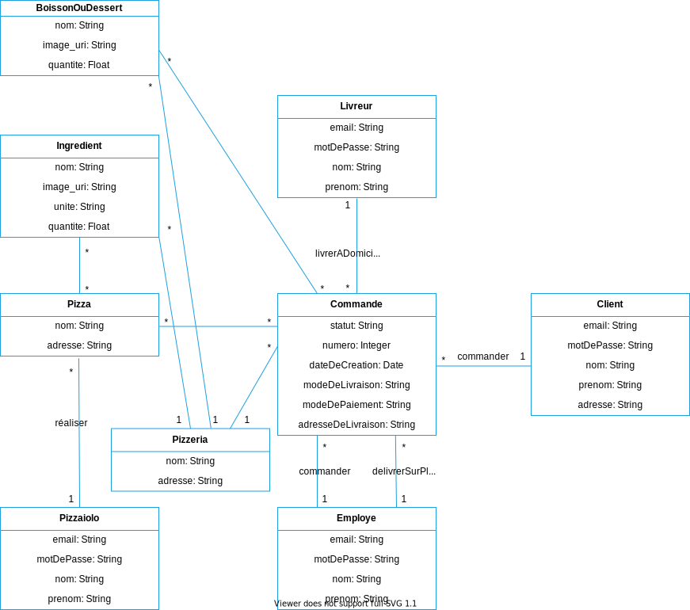

# Spécifications techniques d’un système de gestion de pizzerias

## Modélisation des objets du domaine fonctionnel

### Diagramme de modélisation du domaine fonctionnel

### Diagramme de classes

## Les composants et leurs interactions

## Déploiement des composants

## Modèle physique de données

## Base de données
